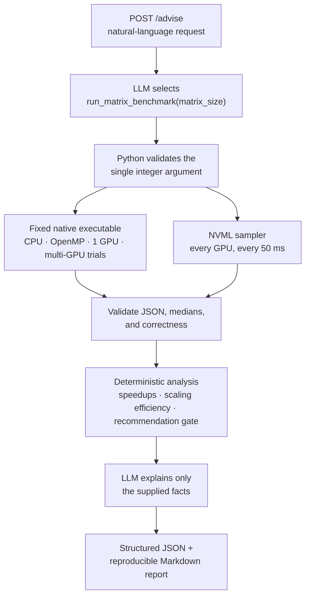

# GPU Workload Advisor

**Benchmarks matrix multiplication on a CPU, with OpenMP, on one GPU, and across multiple
GPUs, then has an LLM explain only what was measured.**


A native C++/CUDA benchmark measures square `float32` matrix multiplication four ways and
samples GPU utilization, memory, temperature, and power through NVML while it runs. Python
checks the results, computes speedups and multi-GPU scaling efficiency, and only then asks an
LLM to explain them. The LLM can trigger the benchmark but never builds a command, and it is
told not to recommend anything when a correctness check fails.

## Results: 2 × Tesla T4 (Kaggle, 2026-09-16)

2048 × 2048 `float32`, median of 5 trials. CUDA times include allocation and host↔device
transfers, and every output was checked against the sequential CPU result.

| Implementation | Median latency | Speedup vs CPU |
|---|---:|---:|
| CPU, sequential | 1,661.2 ms | 1.0× |
| OpenMP, 4 threads | 815.3 ms | 2.0× |
| CUDA, 1 GPU | 68.2 ms | 24.3× |
| **CUDA, 2 GPUs** | **35.1 ms** | **47.3×** |

Two GPUs ran 1.94× faster than one, a scaling efficiency of **0.97**. Efficiency grows with
problem size, because each GPU pays fixed per-GPU costs whatever its share of the work:

| Matrix size | 256 | 512 | 1024 | 2048 |
|---|---:|---:|---:|---:|
| 2 GPUs vs 1 GPU | 0.79× | 1.24× | 1.88× | 1.94× |
| Scaling efficiency | 0.39 | 0.62 | 0.94 | 0.97 |

NVML confirmed that only GPU 0 worked during the single-GPU run and that both GPUs drew power
during the two-GPU run. Per-trial latencies, telemetry, and caveats are in the
[full T4 report](reports/kaggle_t4x2_results.md).

## Highlights

- **Native benchmark in C++/CUDA** ([`native/matrix_benchmark.cu`](native/matrix_benchmark.cu)):
  sequential, OpenMP, single-GPU, and row-split multi-GPU implementations with one host thread
  per GPU, per-trial timing windows, and JSON output.
- **Constrained tool use.** The model can call exactly one strict function,
  `run_matrix_benchmark(matrix_size)`. Python validates the integer and runs one configured
  binary with `shell=False` and a server-set trial count.
- **Numbers are computed before the LLM sees them.** Speedups, scaling efficiency, and the
  correctness gate are calculated in Python. The LLM explains only those supplied fields.
- **GPU telemetry per phase.** A background NVML sampler assigns each sample to a benchmark
  phase, which shows whether every GPU actually did work.
- **Measurement you can audit.** Every result is a median of repeated trials with its
  min–max spread. Transfers are included and one-time CUDA warm-up is excluded. When an
  earlier run turned out to be wrong, the README published a
  [correction](#tesla-p100-2026-09-09) instead of quietly replacing the number.
- **Tested without a GPU.** 56 tests run against a mocked native process, a fake NVML, and a
  mocked LLM, so they pass on a laptop with no CUDA and no API key.

## How a request flows



`POST /benchmark` runs the same pipeline without the LLM.

## Tech stack

| Layer | Technology |
|---|---|
| Benchmark | C++17, CUDA, OpenMP, CMake |
| Service | Python, FastAPI, Pydantic, Uvicorn |
| Telemetry | NVML via `nvidia-ml-py` |
| LLM | Groq Responses API (OpenAI-compatible), `openai/gpt-oss-20b` |
| Tests | pytest, httpx |
| Deployment | Docker on `nvidia/cuda`, Kaggle GPU notebooks |

## Quick start

### No NVIDIA GPU? Run it free on Kaggle

1. Create a Kaggle notebook and upload [`notebooks/kaggle_gpu_demo.ipynb`](notebooks/kaggle_gpu_demo.ipynb).
2. Under **Settings**, set **Accelerator → GPU T4 x2** (two GPUs, so the multi-GPU phase runs)
   and turn **Internet** on.
3. Optional: add a free `GROQ_API_KEY` under **Add-ons → Secrets**. Without it, the notebook
   still runs everything and saves the deterministic report instead of the LLM explanation.
4. Run the cells in order.

The notebook clones this repository, builds the native benchmark, runs the test suite,
benchmarks one size with telemetry, sweeps 256–2048 for the scaling table, and saves
`gpu_workload_report.md` and `scaling_sweep.md` to the Output pane. To test an unmerged
branch, set `REPOSITORY_REF` in the clone cell.

### Local machine with a CUDA GPU

Prerequisites: Python 3.10+, CMake 3.24+, a C++ compiler with OpenMP, and the NVIDIA CUDA
toolkit. A Groq API key is needed only for `/advise`.

```bash
# 1. Build the native benchmark
cmake -S native -B build -DCMAKE_BUILD_TYPE=Release
cmake --build build --parallel

# Optional: run it directly (matrix size, trial count: default 5, max 50)
CUDA_DEVICE_ORDER=PCI_BUS_ID ./build/benchmark_runner 1024 5

# 2. Install the API
python3 -m venv .venv
source .venv/bin/activate
python -m pip install -e ".[dev]"
cp .env.example .env        # then set GROQ_API_KEY for /advise

# 3. Start the service (interactive docs at http://127.0.0.1:8000/docs)
python -m uvicorn app.main:app --reload --env-file .env
```

Run a benchmark without the LLM:

```bash
curl -X POST http://127.0.0.1:8000/benchmark \
  -H "Content-Type: application/json" \
  -d '{"matrix_size": 1024}'
```

Ask the advisor:

```bash
curl -X POST http://127.0.0.1:8000/advise \
  -H "Content-Type: application/json" \
  -d '{"prompt": "Benchmark 1024 x 1024 matrix multiplication and explain the result."}'
```

The `/advise` response contains:

- `benchmark`: validated measurements, per-trial latencies, and GPU telemetry
- `analysis`: speedups, multi-GPU scaling efficiency, and the recommendation gate
- `explanation`: the LLM's explanation, based only on those fields
- `report`: a Markdown report that includes the command to reproduce the native run

Start with a size such as `256`, then try `512` and `1024`. CPU multiplication is cubic, so
doubling the dimension multiplies the arithmetic by about eight.

### Docker (NVIDIA Container Toolkit)

```bash
docker build -t gpu-workload-advisor .
docker run --rm --gpus all -p 8000:8000 \
  -e GROQ_API_KEY -e GROQ_MODEL=openai/gpt-oss-20b \
  gpu-workload-advisor
```

The host still needs a compatible NVIDIA driver and the NVIDIA Container Toolkit, which also
exposes NVML inside the container, so telemetry works there too.

## Measurement policy

- CPU and OpenMP run the same row-oriented loop. CUDA uses a simple educational kernel, not
  cuBLAS, so the numbers compare implementations, not peak GEMM throughput.
- CUDA latency includes allocation, input transfers, kernel execution, output transfer, and
  deallocation. One-time CUDA context initialization is warmed up and excluded on every GPU.
- Each implementation runs `BENCHMARK_REPEATS` trials (default 5). The reported latency is the
  median, shown with the min–max spread, and Python checks that the median matches the trials.
- OpenMP and CUDA outputs are compared with the sequential CPU result on every trial, using a
  floating-point tolerance.
- The benchmark reports the thread count of a real OpenMP parallel region. If a build
  silently drops OpenMP, it reports 1 thread and the report flags it.
- A fresh process's first CUDA trial can include one-time costs such as JIT compilation.
  The median keeps these out of the reported latency, and the min–max column still shows them.
- If CUDA is unavailable or any correctness check fails, the analyzer refuses to make a
  complete CPU/OpenMP/CUDA recommendation.

### Multi-GPU

- Output rows are split evenly across every visible GPU, with one host thread per GPU. Each
  GPU receives its slice of the left matrix and a full copy of the right matrix, runs the same
  kernel, and copies its rows back.
- The GPUs never communicate with each other (no peer-to-peer, NVLink, or NCCL). Per-GPU
  allocation and transfers are timed, as in the single-GPU run.
- Scaling efficiency = (single-GPU latency ÷ multi-GPU latency) ÷ GPU count. A value of 1.0 is
  perfect linear scaling. Each GPU copies the full right matrix, so efficiency rises with size.
- With fewer than two GPUs, the multi-GPU phase is reported as unavailable, and the
  CPU/OpenMP/CUDA comparison still stands.

### GPU telemetry

- [`app/telemetry.py`](app/telemetry.py) samples every GPU through NVML every
  `TELEMETRY_INTERVAL_MS` (default 50 ms), plus a short idle baseline before the run.
- The native benchmark reports a wall-clock window for each implementation, and samples are
  attributed to the single-GPU and multi-GPU windows.
- The runner sets `CUDA_DEVICE_ORDER=PCI_BUS_ID` so that CUDA and NVML number GPUs the same way.
- NVML averages utilization and power over its own sampling period, so short phases can read
  low. Phases with fewer than two samples are not summarized.
- Telemetry is best effort. Without NVML (for example on macOS), the benchmark still runs and
  the result says why telemetry is unavailable.

## Earlier results

### Tesla P100 (2026-09-09)

A 1024 × 1024 run measured 225.588 ms on the CPU and 11.944 ms with CUDA, 18.887× faster with
allocation and transfers included. See the [P100 report](reports/kaggle_p100_results.md).

> **Corrections to the P100 run**
>
> - **OpenMP was not parallel.** Its figure (224.435 ms, 1.005× CPU) was sequential.
>   `OpenMP::OpenMP_CXX` adds `-fopenmp` only to C++ sources, and `matrix_benchmark.cu` is
>   compiled as CUDA, so the OpenMP pragmas were silently ignored. The build now forwards the
>   flag, and the T4 run confirms 4 threads and a 2.0× speedup.
> - **The 256 × 256 CUDA time was probably mostly one-time cost.** It was a single 95.8 ms
>   trial that likely included first-launch costs such as JIT compilation. With repeated
>   trials on a T4, CUDA beat the CPU even at 256 × 256.

## API reference

| Method | Path | Purpose |
|---|---|---|
| `GET` | `/health` | Liveness check |
| `POST` | `/benchmark` | Run the native benchmark and return validated measurements (no LLM) |
| `POST` | `/advise` | Natural-language request → benchmark → analysis → LLM explanation |

Errors:

- `422`: invalid size, an ambiguous or unsupported request, or unapproved tool arguments
- `503`: native executable not built, or `GROQ_API_KEY` missing
- `502`: native benchmark failure, timeout, malformed output, or LLM service failure

**Reading a speedup:** `cuda_vs_cpu` is `CPU latency / CUDA latency`. Above `1.0` means CUDA
was faster in that run. The same rule applies to `openmp_vs_cpu`, `cuda_vs_openmp`,
`cuda_multi_gpu_vs_cpu`, and `cuda_multi_gpu_vs_cuda`. `multi_gpu_scaling_efficiency` divides
`cuda_multi_gpu_vs_cuda` by the GPU count, so 0.9 on two GPUs means 1.8× over one GPU.

## Configuration

| Variable | Default | Purpose |
|---|---|---|
| `GROQ_API_KEY` | none | Required for `/advise` |
| `GROQ_MODEL` | `openai/gpt-oss-20b` | Free-tier, tool-capable model |
| `BENCHMARK_EXECUTABLE` | `./build/benchmark_runner` | The one approved executable |
| `MAX_MATRIX_SIZE` | `2048` | Python-side safety limit |
| `BENCHMARK_TIMEOUT_SECONDS` | `120` | Native process timeout |
| `BENCHMARK_REPEATS` | `5` | Trials per implementation (1–50); latency is the median |
| `TELEMETRY_INTERVAL_MS` | `50` | NVML sampling period |

## Tests

```bash
python -m pytest
```

The suite covers strict inputs, output validation (including median and trial-count checks),
safe process invocation, telemetry sampling and phase attribution against a fake NVML, speedup
and scaling math, correctness gating, tool-call restrictions, API responses, and report wording.
None of it needs CUDA hardware or an API key.

## Project layout

```text
app/
  main.py         FastAPI routes and error mapping
  schemas.py      Request, benchmark, analysis, and response contracts
  benchmark.py    Safe native-process wrapper (fixed binary, shell=False, timeout)
  telemetry.py    Background NVML sampler and per-phase summaries
  analyzer.py     Deterministic speedup, scaling, and correctness analysis
  agent.py        One-tool Groq Responses API loop
  report.py       Reproducible Markdown report
native/
  matrix_benchmark.cu   CPU, OpenMP, 1-GPU and multi-GPU CUDA, timing, correctness
  CMakeLists.txt
notebooks/        Kaggle GPU notebook (build, test, benchmark, sweep, report)
reports/          Measured results from Kaggle P100 and 2 × T4 runs
tests/            GPU-independent unit and API tests
```

## Scope and limitations

- This is a deliberately small agent: no frontend, RAG, vector database, arbitrary shell tool,
  or multi-agent framework.
- The CUDA kernel is intentionally simple and is not compared with cuBLAS. It shows where
  overhead goes, not peak GEMM performance.
- Results hold for the measured hardware, sizes, and implementation only. The Kaggle numbers
  come from shared cloud machines.
- Multi-GPU uses independent row slices with no inter-GPU communication. Peer-to-peer copies
  and NCCL would be the next step for larger or non-separable workloads.
